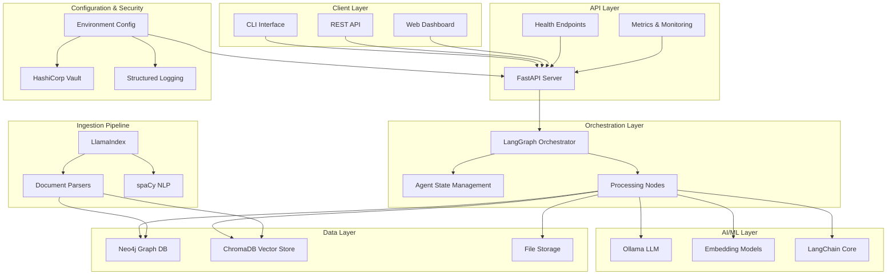
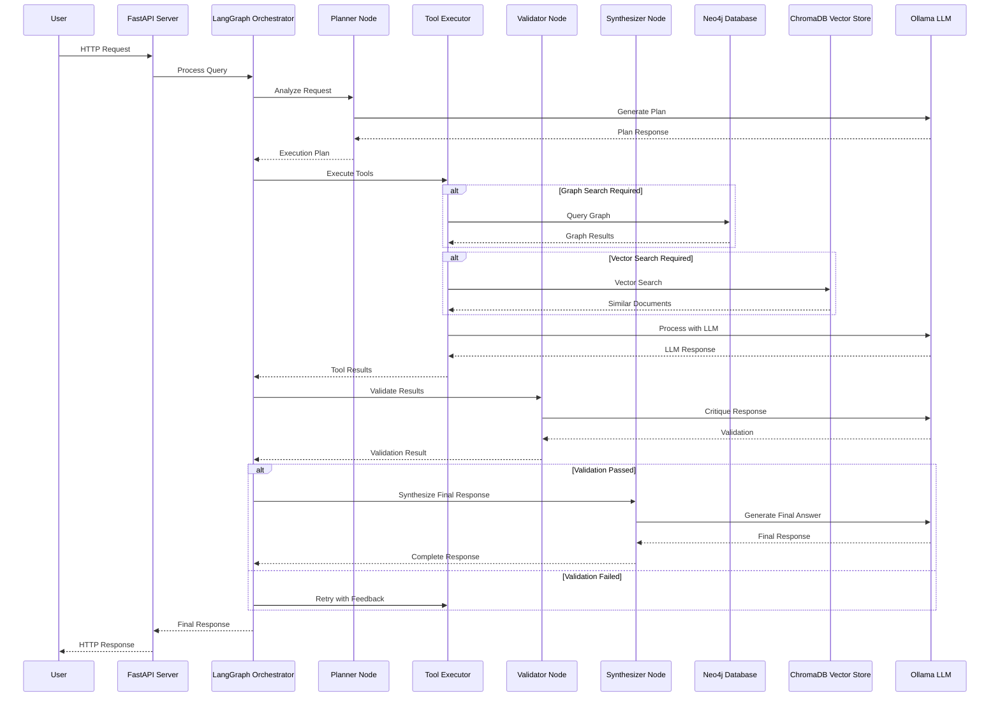

# Cognitive Orchestration Stack

A modular, multi-layer stack for large-language-model cognitive workflows, built on LangGraph, Ollama, Neo4j, ChromaDB, and FastAPI.

## Architecture Overview



## Data Flow



## State Management

The system uses LangGraph's state management to maintain context throughout the processing pipeline:

- **AgentState**: Central state object containing query, plan, results, and validation status
- **Planner Node**: Analyzes incoming queries and creates execution plans
- **Tool Executor**: Executes tools (Neo4j, ChromaDB, Ollama) based on the plan
- **Validator Node**: Critiques and validates results before final synthesis
- **Synthesizer Node**: Combines validated results into the final response

The state flows through conditional edges, allowing for retry logic and dynamic routing based on validation results.

## Getting Started

Follow these steps on your local machine:

```bash
# 1. Clone repository (if you haven't already)
git clone <repo-url>
cd agent_stack

# 2. Create Python 3.11 virtual environment
python -m venv venv

# 3. Activate the environment
# Windows PowerShell
venv\Scripts\Activate.ps1
# macOS/Linux
source venv/bin/activate

# 4. Install dependencies with Poetry
poetry install

# 5. Configure environment variables
cp env.example .env  # copy template
# Open .env and fill in:
#   - NEO4J_URI, NEO4J_USER, NEO4J_PASSWORD (set strong password!)
#   - OLLAMA_HOST, OLLAMA_MODEL, OLLAMA_EMBEDDING_MODEL
#   - LOG_LEVEL (optional)
#   - APP_ENV (dev/prod) - determines which config file to load

# For production, configure HashiCorp Vault:
#   - VAULT_ADDR, VAULT_TOKEN, VAULT_SECRET_PATH

# 6. Verify installation (optional)
poetry run python -c "import langgraph, neo4j, chromadb, fastapi, dotenv, spacy; print('Environment OK')"
```

## Usage

### Data Ingestion

Place source documents into the `data/` folder then run:

```bash
poetry run python -m scripts.ingest_data --source_dir data
```

### Ask the Agent via CLI

```bash
# Interactive mode
poetry run python -m src.main

# Single question mode
poetry run python -m src.main --question "What is the capital of France?"
```

### Health Monitoring & API

Start the comprehensive API server:

```bash
poetry run uvicorn src.api.server:app --host 0.0.0.0 --port 8000
```

#### Health Endpoints

- **Liveness**: `GET /health/live` - Basic process health
- **Readiness**: `GET /health/ready` - Checks all dependencies (Neo4j, ChromaDB, Ollama)

#### Metrics & Monitoring

- **Metrics**: `GET /metrics/` - Performance metrics and counters
- **Dashboard**: `GET /metrics/dashboard` - Interactive HTML dashboard
- **Health Score**: `GET /metrics/health` - System health score and status
- **Reset**: `POST /metrics/reset` - Reset metrics (testing)

#### Documentation

- **API Docs**: `GET /docs` - Interactive Swagger UI
- **ReDoc**: `GET /redoc` - Alternative documentation
- **OpenAPI**: `GET /openapi.json` - OpenAPI schema
- **Troubleshooting**: `GET /docs/troubleshooting` - Common issues guide

#### Examples

```bash
# Health checks
curl http://localhost:8000/health/ready
curl http://localhost:8000/health/live

# Metrics
curl http://localhost:8000/metrics/
curl http://localhost:8000/metrics/health

# Open dashboard in browser
open http://localhost:8000/metrics/dashboard
```

### Secrets Management

The system supports multiple secrets management strategies:

- **🔐 HashiCorp Vault Integration**: Production-ready secrets management with centralized storage
- **🌍 Environment-Specific Configs**: Separate configuration files for dev/prod environments
- **🔒 Secure Fallbacks**: Graceful fallback to environment variables if Vault is unavailable
- **📝 Configuration Validation**: Pydantic-based validation ensures secure settings

#### Vault Configuration

For production deployments, configure HashiCorp Vault:

```bash
# Set Vault connection details
export VAULT_ADDR="https://vault.company.com:8200"
export VAULT_TOKEN="your-vault-token"
export VAULT_SECRET_PATH="secret/data/agent_stack"

# Store secrets in Vault
vault kv put secret/agent_stack \
  neo4j_password="secure-password" \
  ollama_embedding_model="nomic-embed-text"
```

### Performance Features

The system now includes advanced performance optimizations:

- **🚀 Async/Await Support**: Non-blocking operations for better throughput
- **💾 Intelligent Caching**: Reduces redundant computations with smart caching
- **🔧 Query Optimization**: Automatic query performance improvements
- **🧠 Memory Management**: Automatic cleanup and garbage collection
- **📊 Comprehensive Monitoring**: Real-time metrics and health scoring
- **🔌 Connection Pooling**: Optimized database connections
- **⚡ Concurrent Execution**: Parallel tool execution for faster responses

## Development

### Poetry Commands

The project uses Poetry for dependency management and development workflows:

```bash
# Install dependencies
poetry install

# Add a new dependency
poetry add package-name

# Add a development dependency
poetry add --group dev package-name

# Run tests
poetry run pytest

# Run linting
poetry run black src tests
poetry run isort src tests
poetry run flake8 src tests

# Run type checking
poetry run mypy src

# Run security audit
poetry run pip-audit

# Update dependencies
poetry update

# Show dependency tree
poetry show --tree
```

### Environment Management

The system supports multiple environments with automatic configuration loading:

- **Development**: Uses `config/dev.env` with debug logging
- **Production**: Uses `config/prod.env` with JSON structured logging and Vault integration
- **Custom**: Set `APP_ENV` to load `config/{env}.env`
